# Melody Match using MusicBERT

This guide explains how to compute **melody similarity using MusicBERT**, a transformer-based model for symbolic music understanding. The workflow converts MIDI files into embeddings and compares them using cosine similarity.

---

## Table of Contents

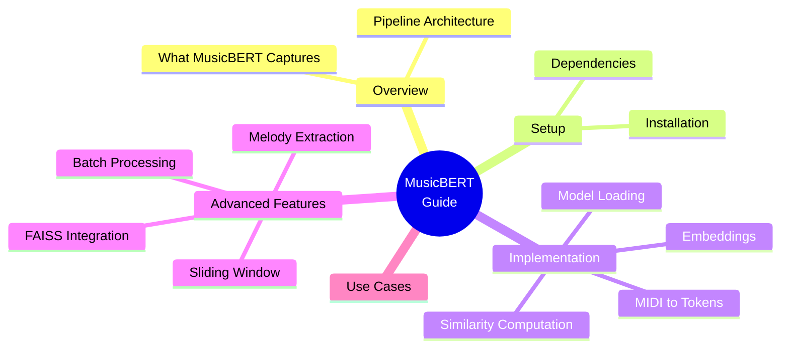

---

# Overview

MusicBERT converts symbolic music (MIDI) into **semantic embeddings** that capture:

* Pitch relationships
* Rhythm patterns
* Harmonic context
* Musical motifs and structure

Similarity between melodies is computed using **vector similarity** instead of rule-based matching.

---

# Complete Pipeline Architecture

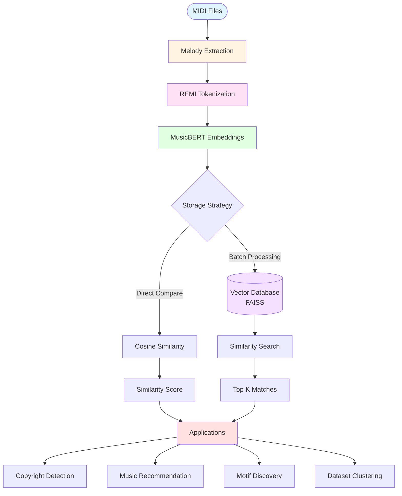

---

# Step 1 — Install Dependencies


```bash
pip install music21 pretty_midi torch numpy scikit-learn
```

Clone and install MusicBERT:

```bash
git clone https://github.com/microsoft/muzic.git
cd muzic/musicbert
pip install -e .
```

Download pretrained weights:

```bash
bash scripts/download_pretrained.sh
```

---

# Step 2 — Convert MIDI → REMI Tokens

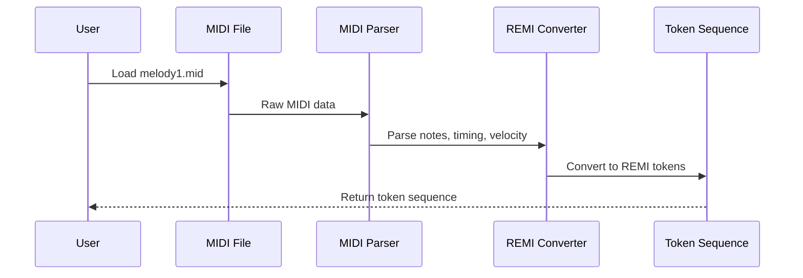

MusicBERT expects **REMI token representation**, not raw MIDI.

```python
import pretty_midi
from musicbert.preprocess import midi_to_remi

def midi_to_tokens(midi_path):
    tokens = midi_to_remi(midi_path)
    return tokens
```

---

# Step 3 — Load MusicBERT Model

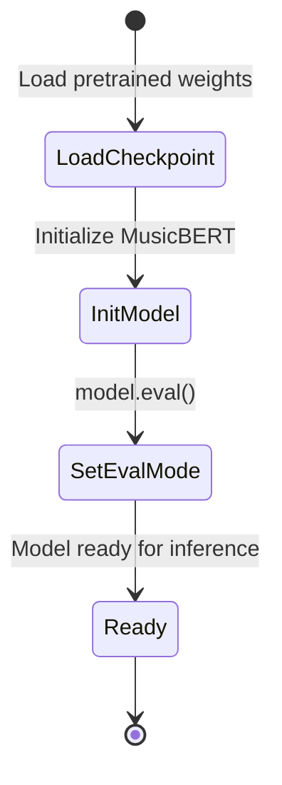

```python
import torch
from musicbert.model.musicbert import MusicBERTModel

model = MusicBERTModel.from_pretrained(
    "musicbert_base",
    checkpoint_file="checkpoint_last_musicbert_base.pt"
)

model.eval()
```

---

# Step 4 — Generate Embeddings

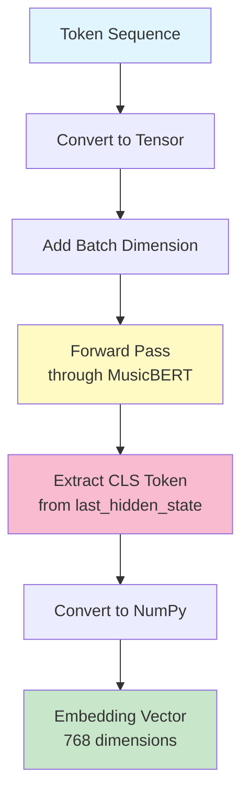

Use the CLS token embedding as the **global melody representation**.

```python
def get_embedding(tokens):
    input_ids = torch.tensor(tokens).unsqueeze(0)

    with torch.no_grad():
        outputs = model(input_ids)

    embedding = outputs.last_hidden_state[:, 0, :]
    return embedding.squeeze().numpy()
```

---

# Step 5 — Compute Melody Similarity

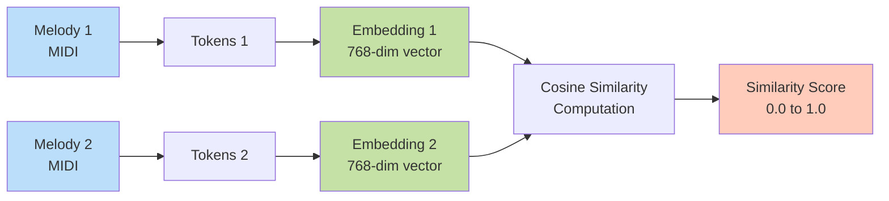

Use cosine similarity between embeddings.

```python
from sklearn.metrics.pairwise import cosine_similarity

tokens1 = midi_to_tokens("melody1.mid")
tokens2 = midi_to_tokens("melody2.mid")

emb1 = get_embedding(tokens1)
emb2 = get_embedding(tokens2)

similarity = cosine_similarity([emb1], [emb2])[0][0]
print("Melody similarity:", similarity)
```

### Similarity Interpretation

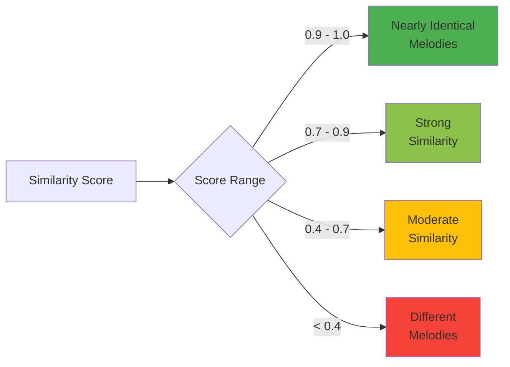

| Score     | Meaning                   |
| --------- | ------------------------- |
| 0.9 – 1.0 | Nearly identical melodies |
| 0.7 – 0.9 | Strong similarity         |
| 0.4 – 0.7 | Moderate similarity       |
| < 0.4     | Different melodies        |

---

# Step 6 — Extract Melody Track (Recommended)

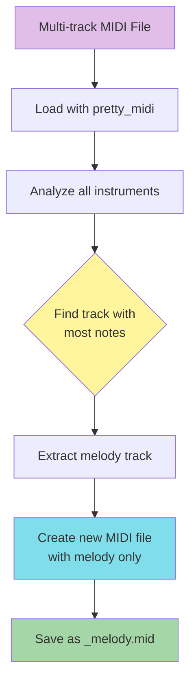

Most MIDI files contain multiple tracks. Extract the **dominant melody track** first.

```python
def extract_melody(midi_path):
    midi = pretty_midi.PrettyMIDI(midi_path)
    melody = max(midi.instruments, key=lambda inst: len(inst.notes))

    new_midi = pretty_midi.PrettyMIDI()
    new_midi.instruments.append(melody)

    out_path = midi_path.replace(".mid", "_melody.mid")
    new_midi.write(out_path)
    return out_path
```

---

# Step 7 — Sliding Window Similarity (Motif Detection)

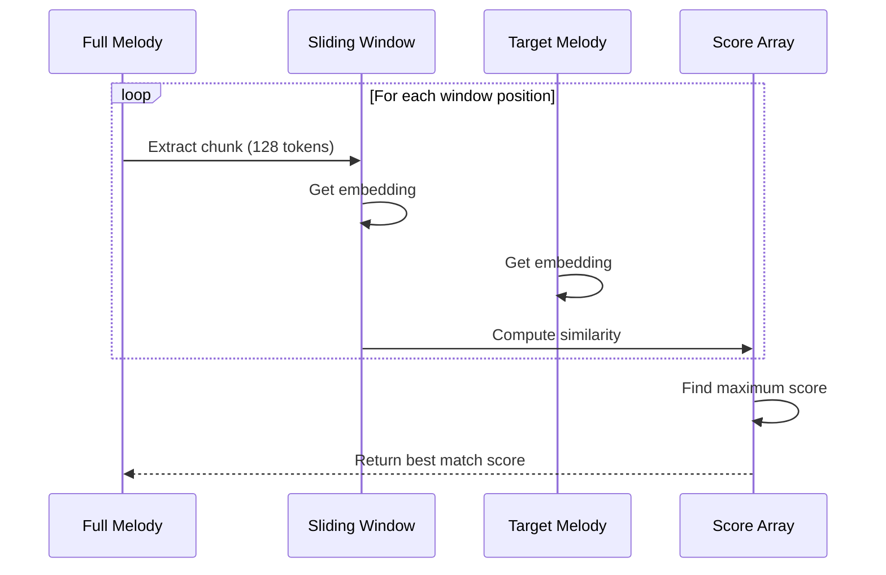

Useful for detecting **partial similarity or plagiarism**.

```python
def sliding_similarity(tokens1, tokens2, window=128):
    scores = []

    for i in range(0, len(tokens1) - window, window):
        chunk = tokens1[i:i+window]
        emb1 = get_embedding(chunk)
        emb2 = get_embedding(tokens2)
        score = cosine_similarity([emb1], [emb2])[0][0]
        scores.append(score)

    return max(scores)
```

---

# Step 8 — Full End-to-End Example

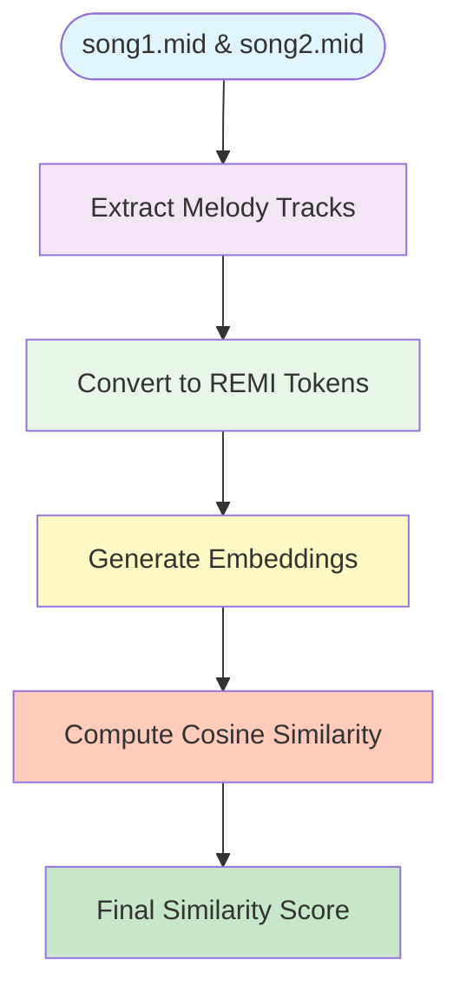

```python
melody1 = extract_melody("song1.mid")
melody2 = extract_melody("song2.mid")

tokens1 = midi_to_tokens(melody1)
tokens2 = midi_to_tokens(melody2)

emb1 = get_embedding(tokens1)
emb2 = get_embedding(tokens2)

similarity = cosine_similarity([emb1], [emb2])[0][0]
print("Final similarity score:", similarity)
```

---

# Why MusicBERT Works Better Than Traditional Methods

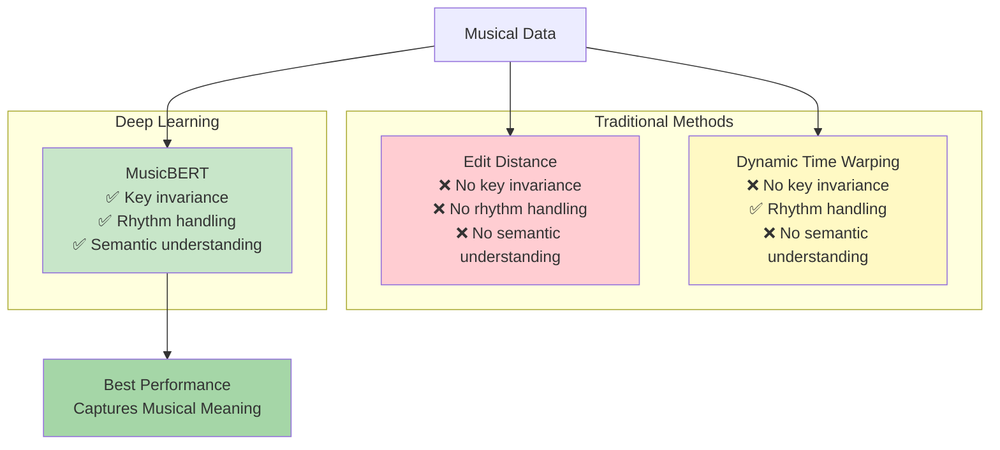

| Method        | Key Invariance | Rhythm Handling | Semantic Understanding |
| ------------- | -------------- | --------------- | ---------------------- |
| Edit Distance | ❌              | ❌               | ❌                      |
| DTW           | ❌              | ✅               | ❌                      |
| MusicBERT     | ✅              | ✅               | ✅                      |

MusicBERT captures **musical meaning**, not just note sequences.

---

# Optional: Batch Similarity for Many MIDI Files

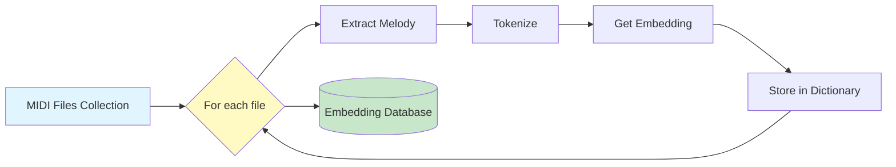

```python
def build_embedding_database(midi_files):
    database = {}

    for path in midi_files:
        melody = extract_melody(path)
        tokens = midi_to_tokens(melody)
        embedding = get_embedding(tokens)
        database[path] = embedding

    return database
```

---

# Optional: Build Melody Search Engine with FAISS

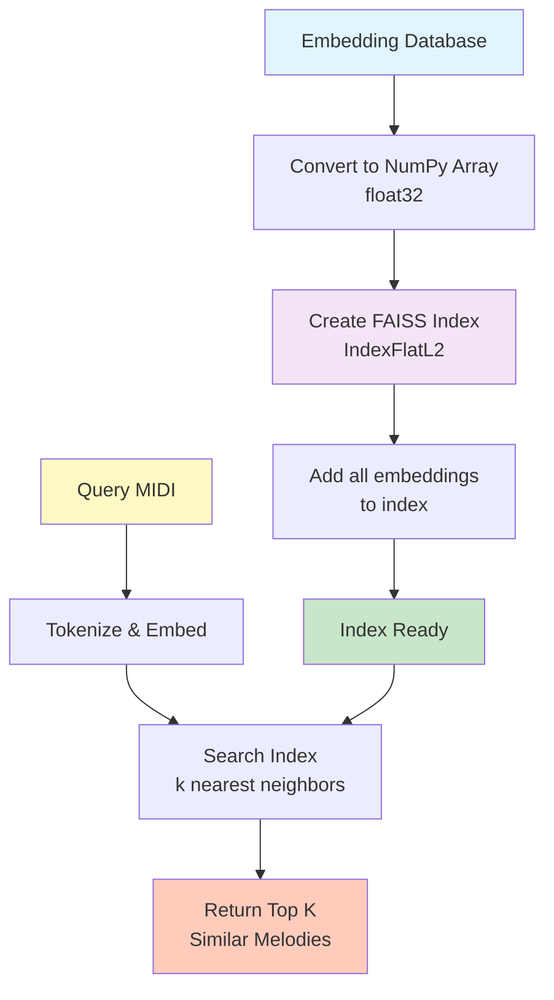

```bash
pip install faiss-cpu
```

```python
import faiss
import numpy as np

embeddings = np.array(list(database.values())).astype("float32")
index = faiss.IndexFlatL2(embeddings.shape[1])
index.add(embeddings)

query = get_embedding(midi_to_tokens("query.mid")).astype("float32")
D, I = index.search(np.array([query]), k=5)
print("Most similar melodies:", I)
```

---

# Recommended System Architecture

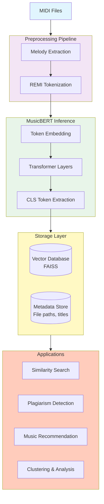

---

# Use Cases

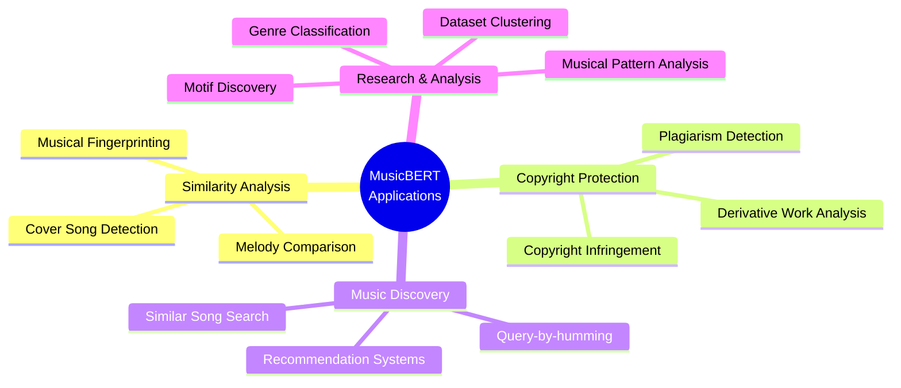

* **Melody similarity scoring** — Compare two melodies for similarity
* **Copyright / plagiarism detection** — Detect unauthorized copying
* **Music recommendation** — Find similar songs for recommendations
* **Motif discovery** — Identify recurring musical patterns
* **Dataset clustering** — Group similar melodies together
* **Query-by-humming** — Match hummed melodies (symbolic form)

---

# Implementation Timeline


---

# Performance Considerations

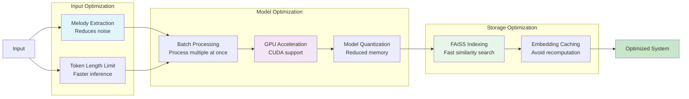

---

# Next Steps

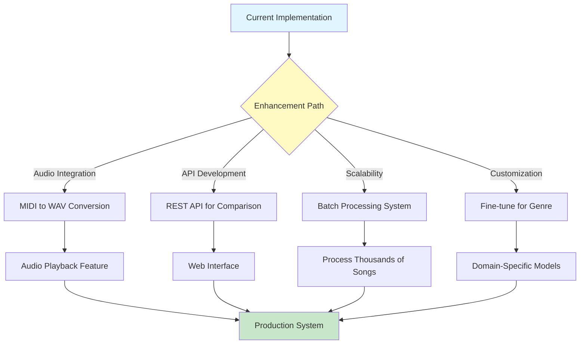

You can extend this system by:

* **Converting MIDI → WAV** for audio playback
* **Building a web API** for melody comparison
* **Running batch similarity** across thousands of songs
* **Fine-tuning MusicBERT** for genre-specific similarity

---

# Complete Code Example

```python
# Complete working example combining all steps

import pretty_midi
import torch
import numpy as np
from sklearn.metrics.pairwise import cosine_similarity
from musicbert.preprocess import midi_to_remi
from musicbert.model.musicbert import MusicBERTModel

class MelodyMatcher:
    def __init__(self, model_path="musicbert_base", checkpoint="checkpoint_last_musicbert_base.pt"):
        """Initialize MusicBERT model"""
        self.model = MusicBERTModel.from_pretrained(model_path, checkpoint_file=checkpoint)
        self.model.eval()
        self.cache = {}

    def extract_melody(self, midi_path):
        """Extract dominant melody track from MIDI"""
        midi = pretty_midi.PrettyMIDI(midi_path)
        melody = max(midi.instruments, key=lambda inst: len(inst.notes))
        new_midi = pretty_midi.PrettyMIDI()
        new_midi.instruments.append(melody)
        out_path = midi_path.replace(".mid", "_melody.mid")
        new_midi.write(out_path)
        return out_path

    def get_embedding(self, midi_path):
        """Get MusicBERT embedding for a MIDI file"""
        if midi_path in self.cache:
            return self.cache[midi_path]

        tokens = midi_to_remi(midi_path)
        input_ids = torch.tensor(tokens).unsqueeze(0)

        with torch.no_grad():
            outputs = self.model(input_ids)

        embedding = outputs.last_hidden_state[:, 0, :].squeeze().numpy()
        self.cache[midi_path] = embedding
        return embedding

    def compute_similarity(self, midi1, midi2):
        """Compute similarity between two MIDI files"""
        emb1 = self.get_embedding(midi1)
        emb2 = self.get_embedding(midi2)
        return cosine_similarity([emb1], [emb2])[0][0]

    def find_similar(self, query_midi, database_midis, top_k=5):
        """Find top-k similar melodies from database"""
        query_emb = self.get_embedding(query_midi)
        similarities = []

        for midi_path in database_midis:
            emb = self.get_embedding(midi_path)
            sim = cosine_similarity([query_emb], [emb])[0][0]
            similarities.append((midi_path, sim))

        similarities.sort(key=lambda x: x[1], reverse=True)
        return similarities[:top_k]

# Usage example
if __name__ == "__main__":
    matcher = MelodyMatcher()

    # Extract melodies
    melody1 = matcher.extract_melody("song1.mid")
    melody2 = matcher.extract_melody("song2.mid")

    # Compute similarity
    similarity = matcher.compute_similarity(melody1, melody2)
    print(f"Similarity: {similarity:.4f}")

    # Find similar songs in database
    database = ["song1.mid", "song2.mid", "song3.mid"]
    results = matcher.find_similar("query.mid", database, top_k=3)

    print("\nTop matches:")
    for path, score in results:
        print(f"{path}: {score:.4f}")
```

---

# End of Guide

**Created with enhanced Mermaid visualizations for better understanding of the MusicBERT melody matching workflow.**
